# Flow Documentation — Sundara Salon Booking & Loyalty Platform

> Single source of truth for all product flows. Kept in sync with implementation. Never documents behavior that doesn't exist.
> Brand: **Sundara** — "Your beauty, your time."

---

## A. Overall System Flow

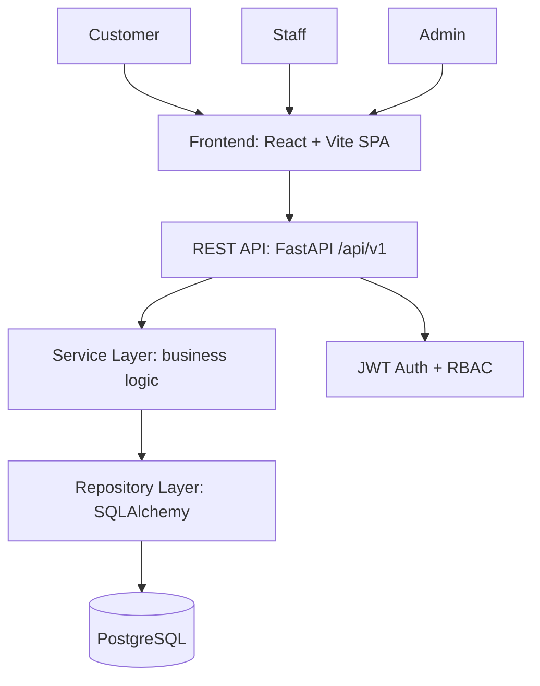

**Description:**
- All three roles use the same SPA, separated by route guards (`/`, `/staff`, `/admin`).
- Frontend never talks to DB directly. All state changes go through REST API.
- Business logic (availability, loyalty calc, tier upgrade) lives in Service Layer, never in route handlers or React components.
- Auth middleware validates JWT + role on every protected endpoint.

---

## B. Customer Journey (End-to-End)

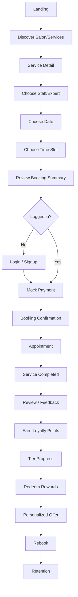

**Stages and exit criteria:**
1. Landing → editorial page: hero → experience → services menu → interior → booking strip → experts → loyalty → voices → welcome-back (logged-in) → final CTA. Marketing content is curated; booking & auth stay live.
2. Discovery → browse services by category, price, duration.
3. Booking flow (6 steps, see D).
4. Payment → mock payment, backend-verified.
5. Confirmation → booking number, summary, loyalty preview.
6. Post-service → review → points → tier → rewards → rebook.

---

## C. Authentication Flow

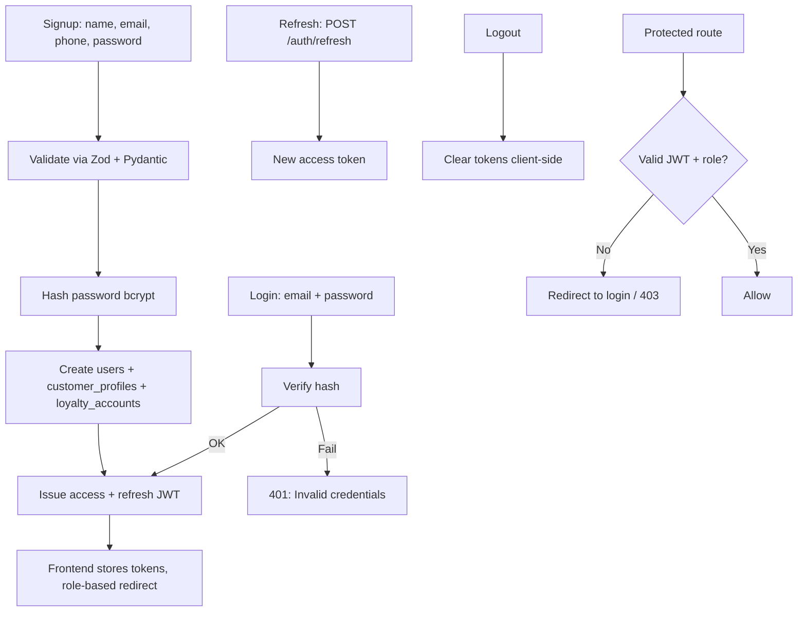

**Rules:**
- Access token 15 min, refresh token 7 days.
- Roles: `customer`, `staff`, `admin`. Staff/admin created via admin panel or seed, not public signup.
- MVP: email + password only. Phase 2: phone + OTP, OAuth.
- Passwords never stored in plain text, never returned by API.
- Login page: two-column (brand photo + form), compact footer. Friendly error copy (no raw codes). Dev-only "Continue as demo" uses the real login path with the seeded customer. No password-reset endpoint — forgot-password shows an honest notice with the salon phone number. Role redirects: customer → /dashboard, staff → /staff, admin → /admin; deep-link `state.from` honored after login.

---

## D. Booking Flow (Critical Path)

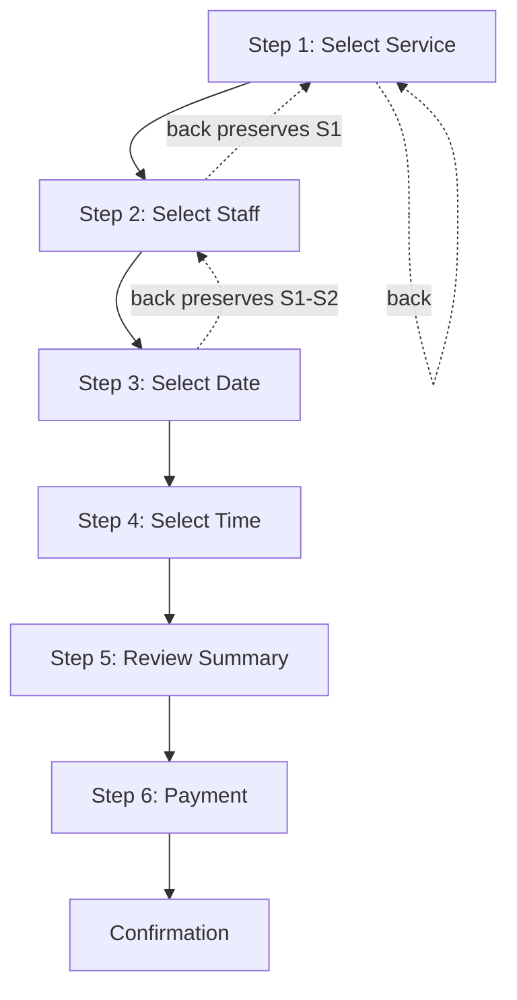

**Step details:**

| Step | Input | Validation | Backend source |
|------|-------|------------|----------------|
| 1. Service | 1+ services | service.is_active | `GET /services` |
| 2. Staff | 1 staff per service item | staff offers service via `staff_services` | `GET /staff?service_id=` |
| 3. Date | calendar date | date >= today, staff works that weekday | `staff_availability` |
| 4. Time | slot | within working hours, no overlap, no block | `GET /availability?staff_id&date&service_id` |
| 5. Review | confirm | full re-validation server-side | `POST /bookings` (draft/validate) |
| 6. Payment | mock pay | payment verified by backend | `POST /payments` + verify |
| Confirm | — | booking status = confirmed | booking_number issued |

**Edge cases:**
- Slot taken between selection and payment → `409 BOOKING_CONFLICT` → "That time was just taken. Please choose another slot." User returns to Step 4, other selections preserved.

**Booking journey (implemented):**
```
Landing / Services
  ↓ Book now (auth-guarded → /login with return path)
Service (image grid, real catalog)
  ↓ Continue (Back hidden on step 1 → Services link)
Expert (photo cards, only staff offering the service)
  ↓ Back preserves service
Date (14-day strip, Sundays disabled — staff work Mon-Sat)
  ↓ Back preserves expert
Time (real availability, 12h labels, empty → choose another date)
  ↓ Back preserves date
Review (per-section edits, price = sum, no invented tax)
  ↓ Reserve (creates pending booking; 409 → back to Time with message)
Payment (demo checkout, honest copy)
  ↓ Backend verifies, confirms
Confirmation (real details + booking number → View my visit / Home)
  ↓
My Visits (rebook prefill via ?service_id=&staff_id=)
```
Branches: no availability → another date; payment fail → retry, booking stays pending; booking fail → not confirmed, explicit message; session expired → login (selections kept); refresh → step 1 (or step 2 when both service+staff params present).

**Staff ops chain (implemented 16 Sept 2026):**
```
Customer books (pending) → staff Dashboard/Appointments → detail → Confirm (history row)
  → customer sees Confirmed → Start → Complete (+ earn ledger 1pt/₹10, idempotent)
  → customer Glow Points → Review (+50 idempotent) → ledger.
Reschedule/cancel from either side propagate to the other. Staff mutations own-jobs-only
(admin: all). Invalid transitions → 422 + message. See staff-flow.md.
```

**Glow Points journey (implemented):**
```
Open Glow Points → fetch account + tiers + rewards + ledger (skeletons, never fake 0)
  → serif balance + tier + benefits line
  → thin progress (lifetime/next threshold; Radiance shows "highest tier")
  → one contextual CTA (afford → rewards; near tier → book; zero → first visit)
  → rewards: afford → confirm dialog → code + authoritative balance; short → exact gap + earn link
  → tier journey rows (current highlighted)
  → date-grouped ledger (+green/−coral, redeem entries appear immediately)
  → how-it-works (documented 1pt/₹10 rule, completion hook pending Stage 6)
```
Failure paths: loyalty 500 → retry block; rewards fail → retry block; ledger fail → quiet note, balance stays; insufficient → exact gap; unknown reward → 404; double redeem → balance re-checked per request.
- Staff goes on leave (new `staff_blocks` row) → affected bookings flagged for admin, customer notified.
- Service deactivated mid-flow → blocked at review step with message.
- Multi-service booking: each `booking_items` row has its own staff/time; end_time = start + duration.
- Double-booking prevention: DB unique constraint on `(staff_id, start_time)` where status in (confirmed, in_progress) + service-layer check with row lock at creation.

---

## E. Cancellation Flow

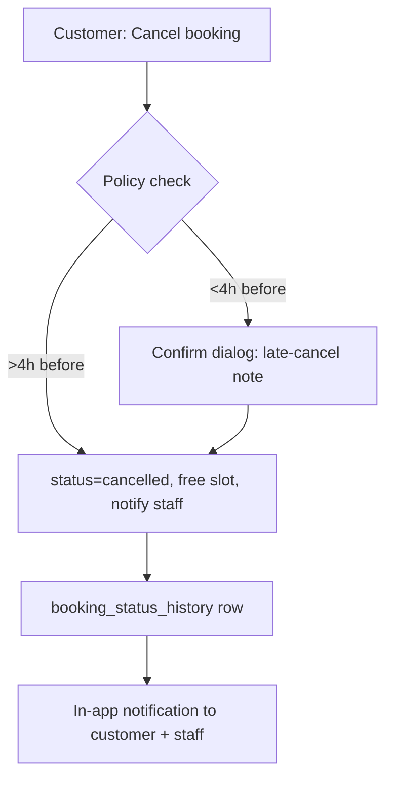

**MVP policy:** Free cancellation up to 4 hours before appointment. No refund logic in MVP (mock payment). No loyalty deduction on cancel.
**Phase 2:** Cancellation fee %, refund to source, points clawback if earned prematurely (points only earned on completion, so no clawback needed).

---

## F. Rescheduling Flow

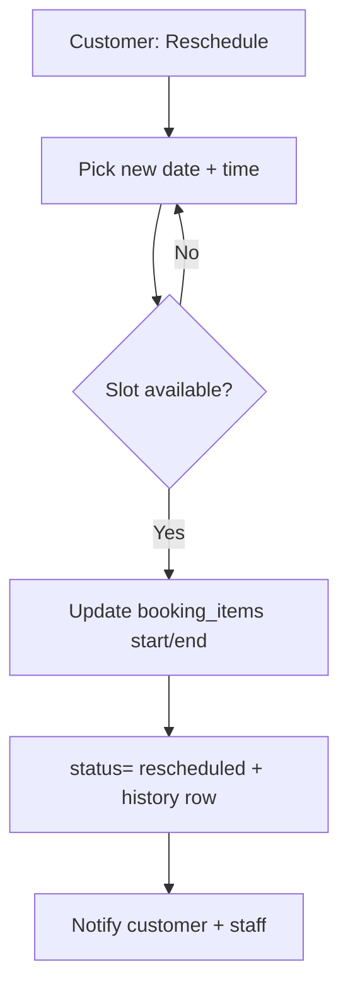

**Rules (MVP):** Phase 2 feature — not in MVP. One reschedule per booking, up to 4h before. Old slot freed atomically in same transaction as new slot reservation.
**Status:** Documented, not yet implemented.

---

## G. Appointment Completion Flow

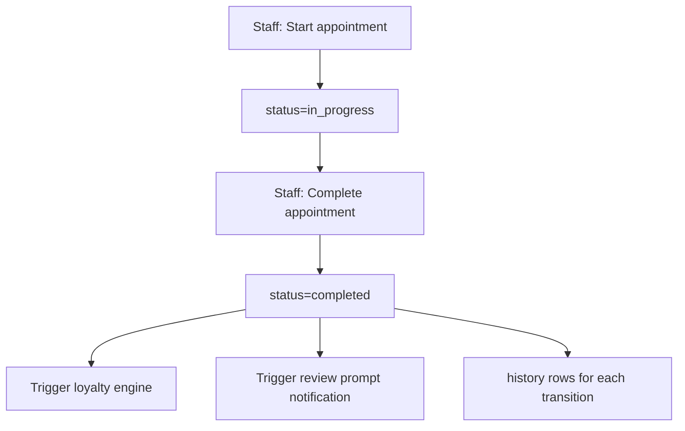

- Only `staff` (own bookings) or `admin` can transition statuses.
- Status machine: `pending → confirmed → in_progress → completed`, with `cancelled` reachable from pending/confirmed, `no_show` from confirmed/in_progress.
- Invalid transitions rejected with `422 INVALID_STATUS_TRANSITION`.

---

## H. Loyalty Flow

```mermaid
flowchart TD
    CS[Service Completed] --> CP[Calculate points: floor(amount/10)]
    CP --> LT[Insert loyalty_transactions row]
    LT --> UB[Update loyalty_accounts balance + total_earned]
    UB --> TC{Tier threshold crossed?}
    TC -- Yes --> TU[Update tier + notify You reached X]
    TC -- No --> DN
    TU --> DN[Check reward eligibility notification]
    DN --> N[Notify: You earned N points]
```

**Invariants:**
- Every points change = one `loyalty_transactions` row. Never overwrite balance without a transaction.
- Points earned only on `completed` status, never on booking creation.
- Review bonus (+50) only once per booking (unique constraint on `reference_type=review + reference_id=booking_id`).
- Referral bonus (+200) only when referred user completes first service.
- Tier computed deterministically from `total_earned` (lifetime), thresholds: Seed 0 / Bloom 500 / Flourish 1500 / Radiance 4000.
- **Status:** Phase 2 (Stage 6). MVP ships booking only; loyalty tables created in Stage 3 schema.

---

## I. Reward Redemption Flow

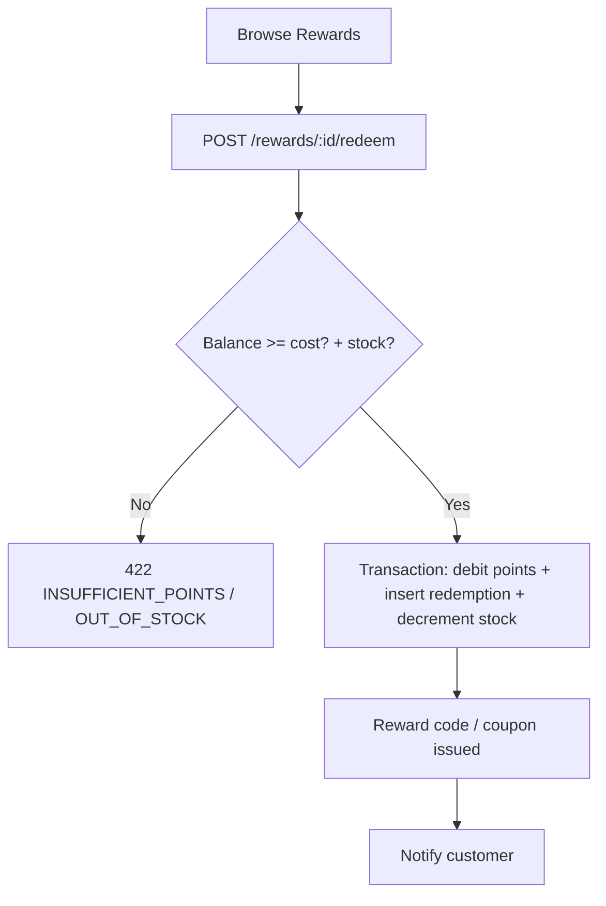

- Single DB transaction: loyalty debit + `reward_redemptions` insert + stock decrement. Rollback on any failure.
- **Status:** Phase 2.

---

## J. Review Flow

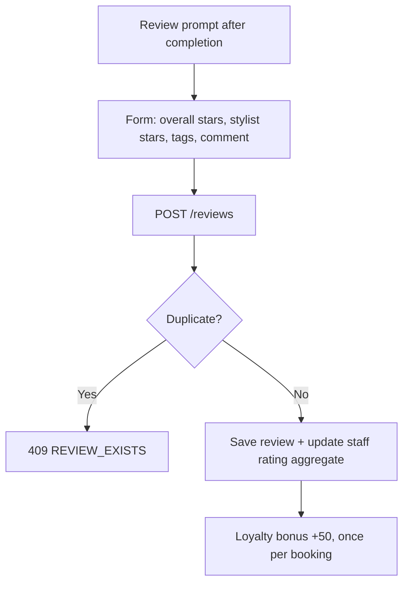

- One review per booking (unique `booking_id`).
- Only `completed` bookings reviewable.
- **Status:** Phase 2.

---

## K. Referral Flow

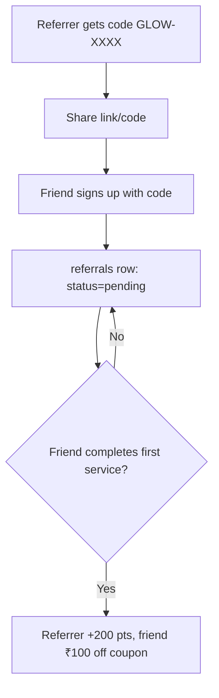

- Points awarded only on qualifying event (first completed service), never on code entry.
- **Status:** Phase 2.

---

## L. Recommendation Flow (Rule-Based)

```
1. Repeat Service (3+ bookings of X) → suggest related service
   Haircut → Hair Spa | Facial → Cleanup | Manicure → Pedicure
2. Time-Based Rebook (last booking 25+ days ago) → "Book Again" card
3. Tier Nudge (within 100 pts of next tier) → "X points from Y" banner
4. Complementary (Hair Coloring booked) → "Add Hair Spa — ₹200 off"
```

- Pure SQL + service-layer rules. No ML. Explainable ("Because you booked X 3 times").
- **Status:** Phase 2 (Stage 7).

---

## M. Admin Flow

```
Login (role=admin) → Admin Dashboard
├── Today's Bookings (table, filter by status/branch/staff)
├── Today's Revenue (sum of completed payments)
├── New vs Returning Customers
├── Cancellation Rate
├── Popular Services (by booking count)
├── Loyalty Activity (points issued/redeemed)
├── Manage: Bookings / Customers / Staff / Services / Salon
├── Loyalty config: tiers, rewards, offers
└── Reviews moderation + Analytics
```

- Admin UI prioritizes density: tables, filters, pagination. No marketing hero.
- All admin endpoints under `/api/v1/admin/*`, guarded by `role=admin`.

---

## N. Staff Flow

```
Login (role=staff) → Staff Dashboard (Today view)
├── 09:00 Haircut — Rahul — Confirmed [Start]
├── 10:30 Hair Spa — Priya — In Progress [Complete]
├── 12:00 BREAK
├── Appointment detail: customer prefs, history, notes
├── Add service notes / customer preferences
└── Manage my availability (working hours + blocks)
```

- Staff sees only own appointments.
- Can transition own bookings: confirmed → in_progress → completed, or mark no_show.

---

## O. Error Flows

| Scenario | Backend | Frontend copy | Recovery |
|----------|---------|---------------|----------|
| Slot conflict | 409 BOOKING_CONFLICT | "That time was just taken. Please choose another slot." | Return to Step 4, keep other selections |
| Payment failure | 402 PAYMENT_FAILED | "Payment didn't go through. Your appointment hasn't been confirmed." | Retry payment, booking held as pending 15 min |
| Network failure | — | "We couldn't connect right now. Please try again." | Retry button, TanStack Query auto-retry 1x |
| Unauthorized | 401/403 | Redirect to login | Role-based redirect after login |
| Validation | 422 + field errors | Inline field messages | Fix and resubmit |
| Empty appointments | 200 + [] | "No upcoming appointments yet." + [Book Now] | CTA to booking |
| Past date selected | client guard | Date picker disables past dates | — |

---

## P. API Flow (Request Lifecycle)

```
Frontend (TanStack Query)
  → GET/POST /api/v1/... + Bearer JWT
  → FastAPI route (thin: parse + auth check)
  → Pydantic schema validation (422 on fail)
  → Service function (business logic + transactions)
  → Repository (SQLAlchemy queries)
  → PostgreSQL
  → Response envelope { success, data, meta } or { success: false, error: { code, message } }
```

- Standard envelope for all endpoints (see decision.md §API Architecture).
- Pagination: `?page=&per_page=` → `meta: { page, per_page, total }`.
- Auth: `Authorization: Bearer <access_token>`.

---

## Q. Database Relationships

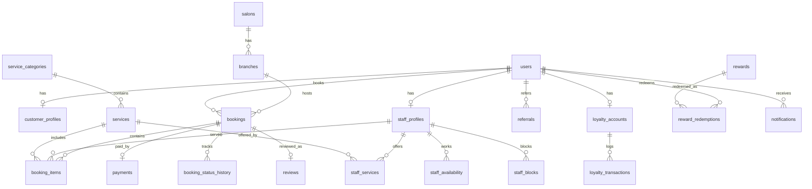

Full DDL with keys, indexes, and constraints lands in Stage 3. Decisions on tables recorded in `decision.md`.

---

## Stage Status

| Stage | Status |
|-------|--------|
| 0 Discovery (flow.md + decision.md) | ✅ Complete |
| 1 Design Foundation (tokens + board) | ✅ Complete |
| 2 Frontend Foundation | ✅ Complete |
| 3 Backend Foundation | ✅ Complete (9/9 tests, live E2E verified) |
| 4 Authentication | ✅ Complete (15/15 tests, browser-verified guards) |
| 5 Booking Engine | Planned |
| 6 Loyalty Engine | Planned (Phase 2) |
| 7 Customer Experience | Planned (Phase 2) |
| 8 Staff + Admin | Planned |
| 9 Payment + Notifications | Planned |
| 10-13 Polish, Stabilize, Test | Planned |

*Last updated: Stage 0. MVP = Stages 1–5 + Staff/Admin basics. Loyalty/Reviews/Referrals = Phase 2.*
